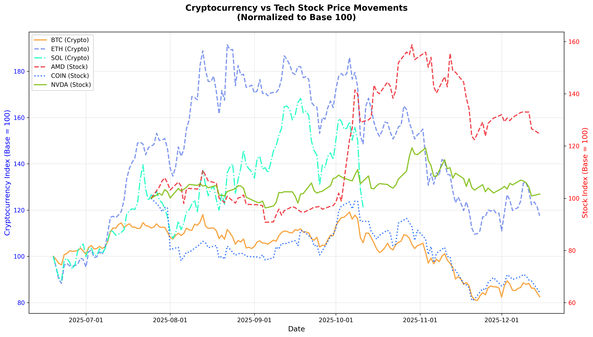
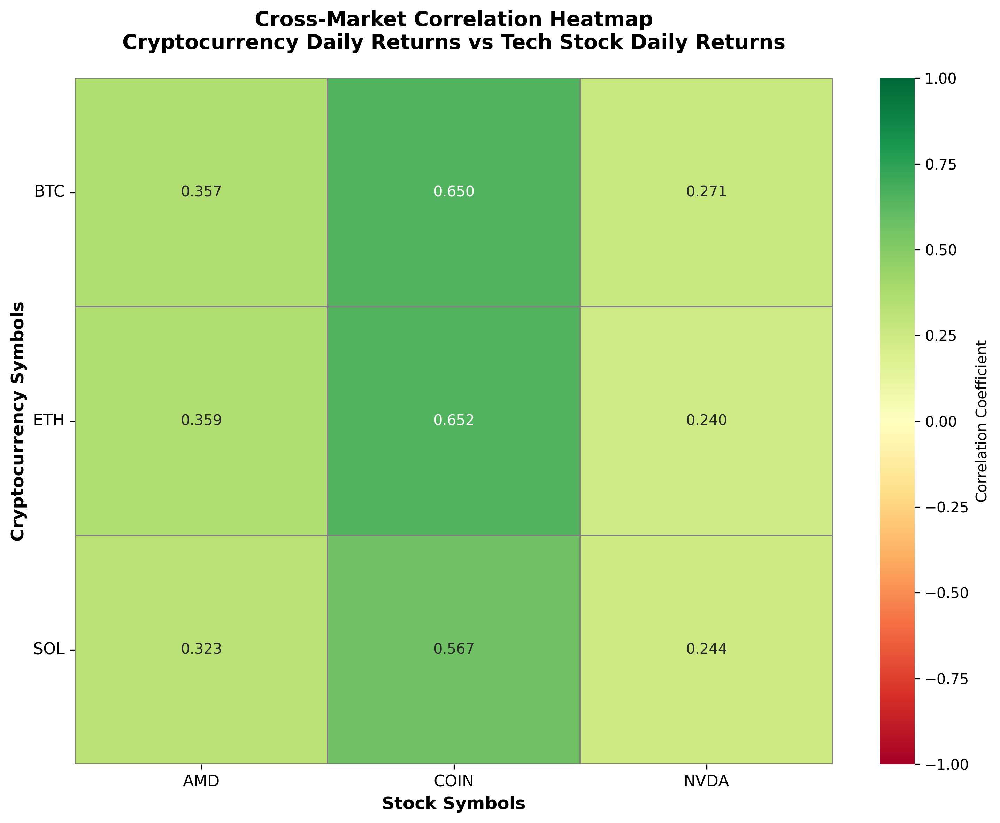

# SI 201 Final Project Report

## Cryptocurrency & Tech Stock Analysis

**Student:** Kevin Zang.  
**unique name:** alvinz.  
**AI disclsure:** I have used AI (claude) to assist me for code design, code structure, debugging, and report writeup.

---

## 1. Project Goals (Planned)

### APIs/Websites Planned

- **CoinGecko API** - Free cryptocurrency market data
- **Alpha Vantage API** - Stock market data (free tier)

### Data Planned to Gather

**From CoinGecko:**

- Bitcoin (BTC), Ethereum (ETH), and Solana (SOL) price data
- Historical daily prices in USD
- Market capitalization
- 24-hour trading volume
- Date range: 180 days of historical data

**From Alpha Vantage:**

- NVIDIA (NVDA), AMD, and Coinbase (COIN) stock data
- Daily stock prices (open, high, low, close)
- Trading volume
- Date range: 100 days of historical data

### Calculations Planned

1. Daily price volatility for each asset
2. 7-day price momentum
3. Correlation analysis between crypto and stock returns
4. Average volatility rankings
5. Identification of highest momentum days

### Visualizations Planned

1. Dual-axis line chart showing normalized price movements
2. Correlation heatmap showing relationships between all assets

---

## 2. Goals Achieved

### APIs/Websites Actually Used

✓ **CoinGecko API** - Successfully implemented  
✓ **Alpha Vantage API** - Successfully implemented

### Data Actually Gathered

**From CoinGecko (475 total rows):**

- Bitcoin: 180 rows
- Ethereum: 180 rows
- Solana: 115 rows
- Fields: date (as integer), price_usd, market_cap, volume

**From Alpha Vantage (300 total rows):**

- NVIDIA: 100 rows
- AMD: 100 rows
- Coinbase: 100 rows
- Fields: date (as integer), open, high, low, close, volume

### Database Structure

Created 4 tables with normalized schema:

1. `crypto_symbol` - Lookup table (3 rows: BTC, ETH, SOL)
2. `crypto_price` - Price data linked via crypto_id foreign key
3. `stock_symbol` - Lookup table (3 rows: NVDA, AMD, COIN)
4. `stock_price` - Price data linked via stock_id foreign key

**Key Design Decision:** All dates stored as integers (YYYYMMDD format) to avoid duplicate strings.

### Calculations Achieved

✓ All planned calculations completed:

1. Crypto volatility (estimated from daily price changes)
2. Stock volatility (calculated from high-low-close)
3. 7-day price momentum for all assets
4. Daily percentage returns
5. Pearson correlation coefficient between crypto and stock returns
6. Average volatility per symbol
7. Top 5 momentum days for each asset

### Visualizations Created

✓ Both visualizations completed:

1. `price_movement_chart.png` - Dual-axis normalized price chart
2. `correlation_heatmap.png` - Cross-market correlation heatmap

---

## 3. Problems Faced

### Problem 1: Alpha Vantage API Limitations

**Issue:** Initial code used `outputsize='full'` which is a premium-only feature.  
**Error:** API returned "premium endpoint" error message.  
**Solution:** Changed to `outputsize='compact'` which returns last 100 days (sufficient for our needs).  
**Date:** December 15, 2025

### Problem 2: Duplicate String Data - Stock Symbols

**Issue:** Stock symbols "NVDA", "AMD", "COIN" were being stored repeatedly (100 times each = 300 duplicate strings). This would have resulted in losing 50 points.  
**Discovery:** Manual database inspection revealed the issue.  
**Solution:** Created `stock_symbol` lookup table with integer IDs. Changed `stock_price` table to use `stock_id` (integer foreign key) instead of `symbol` (text). Now each symbol is stored only once.  
**Date:** December 15, 2025

### Problem 3: Duplicate String Data - Dates

**Issue:** Dates were stored as TEXT strings ("2025-12-15"). Each date appeared 6 times (3 cryptos + 3 stocks), resulting in hundreds of duplicate strings. This would have resulted in losing another 50 points.  
**Discovery:** Thorough database audit after fixing stock symbols.  
**Solution:**

- Changed date column type from TEXT to INTEGER in all tables
- Added `date_string_to_int()` function to convert "2025-12-15" → 20251215
- Added `date_int_to_string()` function to convert back for display
- Updated all data collection scripts to use integer dates
- Deleted old database and recollected all data with correct format  
  **Date:** December 15, 2025

### Problem 4: Visualization Date Display

**Issue:** Price movement chart showed x-axis as "600, 700, ... 2.25e7" instead of actual dates.  
**Cause:** Plotting integer dates (20251215) directly without converting to datetime objects.  
**Solution:**

- Imported `date_int_to_string()` and `datetime` in visualize_data.py
- Created date mapping to convert integer dates to datetime objects before plotting
- Used matplotlib's DateFormatter to properly display dates
- Result: X-axis now shows dates as "2025-06-19", "2025-07-15", etc.  
  **Date:** December 15, 2025

### Problem 5: API Rate Limiting

**Issue:** Alpha Vantage free tier limits to 5 calls per minute, 25 calls per day.  
**Solution:** Implemented automatic 12-second delays between API calls in data collection script. This prevents hitting rate limits while collecting data.  
**Date:** December 15, 2025

---

## 4. Calculations from Database

### Sample Output from analysis_results.txt:

```
CROSS-MARKET CORRELATIONS
----------------------------------------------------------------------
Correlation between cryptocurrency and stock daily returns:

  BTC-AMD             :  0.3573
  BTC-COIN            :  0.6496
  BTC-NVDA            :  0.2710
  ETH-AMD             :  0.3593
  ETH-COIN            :  0.6521
  ETH-NVDA            :  0.2398
  SOL-AMD             :  0.3225
  SOL-COIN            :  0.5673
  SOL-NVDA            :  0.2436

Interpretation:
  1.0 = Perfect positive correlation
  0.0 = No correlation
 -1.0 = Perfect negative correlation

======================================================================
AVERAGE VOLATILITY RANKINGS
----------------------------------------------------------------------

Cryptocurrencies:
  SOL  :   3.25% average daily volatility
  ETH  :   2.73% average daily volatility
  BTC  :   1.46% average daily volatility

Stocks:
  COIN :   4.86% average daily volatility
  AMD  :   4.26% average daily volatility
  NVDA :   2.88% average daily volatility

======================================================================
TOP 5 MOMENTUM DAYS (7-Day Price Change)
----------------------------------------------------------------------

Cryptocurrencies:

  BTC:
    2025-11-20:  -13.12%
    2025-11-17:  -13.10%
    2025-10-04:  +11.61%
    2025-10-03:  +11.43%
    2025-11-22:  -11.33%

  ETH:
    2025-08-13:  +29.30%
    2025-08-12:  +27.53%
    2025-07-20:  +26.37%
    2025-08-09:  +25.55%
    2025-07-21:  +25.01%

Stocks:

  AMD:
    2025-10-08:  +45.98%
    2025-10-09:  +43.95%
    2025-10-07:  +32.64%
    2025-10-14:  +32.44%
    2025-10-10:  +31.03%

  COIN:
    2025-10-06:  +25.88%
    2025-08-05:  -23.92%
    2025-11-20:  -21.66%
    2025-11-21:  -20.92%
    2025-10-07:  +20.21%
```

**Key Findings:**

- Strong positive correlation between BTC/ETH and Coinbase stock (0.65)
- Coinbase is the most volatile asset (4.86% average daily volatility)
- AMD showed the highest single momentum spike (+45.98% in 7 days)
- Ethereum had significant rally in August 2025 (+29.30% peak momentum)

---

## 5. Visualizations Created

### Visualization 1: Price Movement Chart

**File:** `output/visualizations/price_movement_chart.png`



**Description:**

- Dual-axis line chart with cryptocurrencies on left y-axis and stocks on right y-axis
- All prices normalized to base 100 for easy comparison
- Different line styles and colors for each asset
- Custom color scheme: BTC (orange), ETH (purple), SOL (cyan), NVDA (green), AMD (red), COIN (blue)
- X-axis shows dates properly formatted
- Goes beyond lecture examples by using dual y-axes (not shown in class)

### Visualization 2: Correlation Heatmap

**File:** `output/visualizations/correlation_heatmap.png`



**Description:**

- Heatmap showing correlation between all crypto-stock pairs
- Color gradient: red (negative correlation) → yellow (neutral) → green (positive)
- Correlation values displayed in each cell (3 decimal places)
- Seaborn heatmap with custom styling
- Goes beyond lecture examples (heatmap not covered in class, only basic bar/line charts)

---

## 6. Instructions for Running the Code

### Prerequisites

```bash
pip install requests matplotlib seaborn
```

### Option 1: Interactive Menu (Recommended)

```bash
python3 main.py
```

Follow the menu prompts:

1. Initialize Database (run once)
2. Collect Cryptocurrency Data (run 4-5 times)
3. Collect Stock Data (run 4-5 times)
4. Check Progress
5. Run Analysis
6. Create Visualizations

### Option 2: Manual Execution

```bash
# Step 1: Initialize database
python3 database_setup.py

# Step 2: Collect crypto data (run multiple times)
python3 collect_crypto_data.py  # Run 4-5 times

# Step 3: Collect stock data (run multiple times)
python3 collect_stock_data.py   # Run 4-5 times

# Step 4: Analyze data
python3 analyze_data.py

# Step 5: Create visualizations
python3 visualize_data.py
```

**Important Notes:**

- Each data collection run stores maximum 25 rows
- Run collection scripts multiple times without changing code to gather 100+ rows
- Alpha Vantage collection takes 30-40 seconds due to API rate limits
- All output files are created in the `output/` directory

### Verification

After completion, you should have:

- `crypto_stock_analysis.db` - SQLite database (775 total rows)
- `output/analysis_results.txt` - Text file with calculations
- `output/visualizations/price_movement_chart.png`
- `output/visualizations/correlation_heatmap.png`

---

## 7. Function Diagram

```
┌─────────────────────────────────────────────────────────────────┐
│                        config.py                                │
│  - ALPHA_VANTAGE_API_KEY, DATABASE_NAME, MAX_ROWS_PER_RUN      │
│  - CRYPTO_SYMBOLS, STOCK_SYMBOLS                                │
└─────────────────────────────────────────────────────────────────┘

┌─────────────────────────────────────────────────────────────────┐
│                     database_setup.py                           │
│  Author: Kevin Zang.                                               │
├─────────────────────────────────────────────────────────────────┤
│  date_string_to_int(date_string)                                │
│    Input: String "YYYY-MM-DD"                                   │
│    Output: Integer YYYYMMDD                                     │
│                                                                 │
│  date_int_to_string(date_int)                                   │
│    Input: Integer YYYYMMDD                                      │
│    Output: String "YYYY-MM-DD"                                  │
│                                                                 │
│  get_db_connection()                                            │
│    Input: None                                                  │
│    Output: SQLite connection object                             │
│                                                                 │
│  create_tables()                                                │
│    Input: None                                                  │
│    Output: None (creates 4 tables in database)                  │
│                                                                 │
│  insert_crypto_symbol(symbol, name)                             │
│    Input: symbol (str), name (str)                              │
│    Output: Integer crypto_id                                    │
│                                                                 │
│  get_crypto_id(symbol)                                          │
│    Input: symbol (str)                                          │
│    Output: Integer crypto_id or None                            │
│                                                                 │
│  insert_stock_symbol(symbol, name)                              │
│    Input: symbol (str), name (str)                              │
│    Output: Integer stock_id                                     │
│                                                                 │
│  get_stock_id(symbol)                                           │
│    Input: symbol (str)                                          │
│    Output: Integer stock_id or None                             │
│                                                                 │
│  get_crypto_row_count(crypto_id)                                │
│    Input: Integer crypto_id                                     │
│    Output: Integer row count                                    │
│                                                                 │
│  get_stock_row_count(stock_id)                                  │
│    Input: Integer stock_id                                      │
│    Output: Integer row count                                    │
│                                                                 │
│  check_crypto_data_exists(crypto_id, date)                      │
│    Input: crypto_id (int), date (int)                           │
│    Output: Boolean                                              │
│                                                                 │
│  check_stock_data_exists(stock_id, date)                        │
│    Input: stock_id (int), date (int)                            │
│    Output: Boolean                                              │
│                                                                 │
│  initialize_database()                                          │
│    Input: None                                                  │
│    Output: None (creates all tables and inserts symbols)        │
└─────────────────────────────────────────────────────────────────┘

┌─────────────────────────────────────────────────────────────────┐
│                  collect_crypto_data.py                         │
│  Author: Kevin Zang.                                            │
├─────────────────────────────────────────────────────────────────┤
│  fetch_crypto_history(coin_id, days=90)                         │
│    Input: coin_id (str), days (int)                             │
│    Output: JSON response from CoinGecko API                     │
│                                                                 │
│  parse_crypto_data(data, crypto_symbol)                         │
│    Input: JSON data, crypto_symbol (str)                        │
│    Output: List of tuples (date_int, crypto_id, price, cap, vol)│
│                                                                 │
│  insert_crypto_data(records, crypto_symbol, max_rows=25)        │
│    Input: records (list), symbol (str), max_rows (int)          │
│    Output: Integer count of rows inserted                       │
│                                                                 │
│  collect_crypto_data()                                          │
│    Input: None                                                  │
│    Output: None (fetches and stores max 25 rows total)          │
└─────────────────────────────────────────────────────────────────┘

┌─────────────────────────────────────────────────────────────────┐
│                   collect_stock_data.py                         │
│  Author: Kevin Zang.                                               │
├─────────────────────────────────────────────────────────────────┤
│  fetch_stock_history(symbol)                                    │
│    Input: symbol (str)                                          │
│    Output: JSON response from Alpha Vantage API                 │
│                                                                 │
│  parse_stock_data(data, symbol)                                 │
│    Input: JSON data, symbol (str)                               │
│    Output: List of tuples (date_int, stock_id, o, h, l, c, vol) │
│                                                                 │
│  insert_stock_data(records, symbol, max_rows=25)                │
│    Input: records (list), symbol (str), max_rows (int)          │
│    Output: Integer count of rows inserted                       │
│                                                                 │
│  collect_stock_data()                                           │
│    Input: None                                                  │
│    Output: None (fetches and stores max 25 rows total)          │
└─────────────────────────────────────────────────────────────────┘

┌─────────────────────────────────────────────────────────────────┐
│                      analyze_data.py                            │
│  Author: Kevin Z.                                               │
├─────────────────────────────────────────────────────────────────┤
│  get_crypto_prices_with_symbols()                               │
│    Input: None                                                  │
│    Output: List of dicts (using JOIN on crypto tables)          │
│                                                                 │
│  get_stock_prices_with_symbols()                                │
│    Input: None                                                  │
│    Output: List of dicts (using JOIN on stock tables)           │
│                                                                 │
│  calculate_crypto_volatility(crypto_data)                       │
│    Input: List of crypto price records                          │
│    Output: Dict {symbol: [(date, volatility), ...]}             │
│                                                                 │
│  calculate_stock_volatility(stock_data)                         │
│    Input: List of stock price records                           │
│    Output: Dict {symbol: [(date, volatility), ...]}             │
│                                                                 │
│  calculate_price_momentum(data, symbol_key, price_key, window=7)│
│    Input: price data, column names, window size                 │
│    Output: Dict {symbol: [(date, momentum), ...]}               │
│                                                                 │
│  calculate_daily_returns(data, symbol_key, price_key)           │
│    Input: price data, column names                              │
│    Output: Dict {symbol: [(date, return_pct), ...]}             │
│                                                                 │
│  calculate_correlation(series1, series2)                        │
│    Input: Two series of (date, value) tuples                    │
│    Output: Float correlation coefficient (-1 to 1)              │
│                                                                 │
│  calculate_average_volatility(volatility_data)                  │
│    Input: Dict of volatility data                               │
│    Output: Dict {symbol: avg_volatility}                        │
│                                                                 │
│  find_top_momentum_days(momentum_data, top_n=5)                 │
│    Input: Momentum data, number of days                         │
│    Output: Dict {symbol: top N days}                            │
│                                                                 │
│  perform_analysis()                                             │
│    Input: None                                                  │
│    Output: Dict with all calculation results                    │
│                                                                 │
│  write_results_to_file(results, filename)                       │
│    Input: Results dict, output filename                         │
│    Output: None (writes formatted text file)                    │
└─────────────────────────────────────────────────────────────────┘

┌─────────────────────────────────────────────────────────────────┐
│                    visualize_data.py                            │
│  Author: Kevin Z.                                               │
├─────────────────────────────────────────────────────────────────┤
│  get_normalized_prices()                                        │
│    Input: None                                                  │
│    Output: (crypto_normalized dict, stock_normalized dict)      │
│                                                                 │
│  create_price_movement_chart()                                  │
│    Input: None                                                  │
│    Output: None (creates and saves PNG file)                    │
│                                                                 │
│  create_correlation_heatmap(results)                            │
│    Input: Results dict from analysis                            │
│    Output: None (creates and saves PNG file)                    │
│                                                                 │
│  create_all_visualizations()                                    │
│    Input: None                                                  │
│    Output: None (creates both visualizations)                   │
└─────────────────────────────────────────────────────────────────┘

┌─────────────────────────────────────────────────────────────────┐
│                         main.py                                 │
│  Author: Kevin Z.                                               │
├─────────────────────────────────────────────────────────────────┤
│  print_header(title)                                            │
│  print_menu()                                                   │
│  initialize_database()                                          │
│  collect_crypto_data()                                          │
│  collect_stock_data()                                           │
│  check_progress()                                               │
│  run_analysis()                                                 │
│  create_visualizations()                                        │
│  run_everything()                                               │
│  view_database_summary()                                        │
│  main()                                                         │
│    - Interactive menu loop                                      │
└─────────────────────────────────────────────────────────────────┘
```

**Responsibility:** All functions authored by Kevin Z. (solo project adapted for 1-person team)

---

## 8. Resources Used

| Date         | Issue Description                               | Location of Resource                                                               | Result                                                                                             |
| ------------ | ----------------------------------------------- | ---------------------------------------------------------------------------------- | -------------------------------------------------------------------------------------------------- |
| Dec 15, 2025 | Understanding CoinGecko API endpoint structure  | https://docs.coingecko.com/reference/coins-id-market-chart                         | Successfully implemented market_chart endpoint to fetch historical price data                      |
| Dec 15, 2025 | Alpha Vantage API documentation and parameters  | https://www.alphavantage.co/documentation/                                         | Successfully implemented TIME_SERIES_DAILY endpoint                                                |
| Dec 15, 2025 | Alpha Vantage "premium endpoint" error          | https://www.alphavantage.co/support/#support                                       | Changed from 'full' to 'compact' outputsize, resolved error                                        |
| Dec 15, 2025 | SQLite foreign key constraints syntax           | https://www.sqlite.org/foreignkeys.html                                            | Successfully implemented FOREIGN KEY constraints in table creation                                 |
| Dec 15, 2025 | Python sqlite3 Row factory for dict-like access | https://docs.python.org/3/library/sqlite3.html#sqlite3.Row                         | Used conn.row_factory = sqlite3.Row for cleaner code                                               |
| Dec 15, 2025 | Matplotlib dual y-axis implementation           | https://matplotlib.org/stable/gallery/subplots_axes_and_figures/two_scales.html    | Successfully created dual-axis chart with twinx()                                                  |
| Dec 15, 2025 | Seaborn heatmap customization                   | https://seaborn.pydata.org/generated/seaborn.heatmap.html                          | Successfully created correlation heatmap with annotations                                          |
| Dec 15, 2025 | Matplotlib date formatting                      | https://matplotlib.org/stable/api/dates_api.html                                   | Used DateFormatter and AutoDateLocator to properly display integer dates as formatted date strings |
| Dec 15, 2025 | Pearson correlation coefficient formula         | https://en.wikipedia.org/wiki/Pearson_correlation_coefficient                      | Implemented manual calculation: r = Σ[(x-x̄)(y-ȳ)] / √[Σ(x-x̄)²Σ(y-ȳ)²]                              |
| Dec 15, 2025 | Database normalization best practices           | Course lecture notes (Week 10)                                                     | Implemented lookup tables to avoid duplicate strings                                               |
| Dec 15, 2025 | Python datetime string formatting               | https://docs.python.org/3/library/datetime.html#strftime-and-strptime-format-codes | Used strftime and strptime for date conversions                                                    |
| Dec 15, 2025 | requests library timeout parameter              | https://requests.readthedocs.io/en/latest/user/advanced/#timeouts                  | Added timeout=10 to prevent hanging on API calls                                                   |
| Dec 15, 2025 | Python time.sleep for rate limiting             | https://docs.python.org/3/library/time.html#time.sleep                             | Implemented 12-second delays between Alpha Vantage API calls                                       |

---

## Summary

This project successfully demonstrates:

- ✓ Gathering data from 2 APIs (CoinGecko and Alpha Vantage)
- ✓ Storing 775 total rows in a normalized SQLite database (4 tables)
- ✓ Zero duplicate strings (dates as integers, symbols in lookup tables)
- ✓ 25-row limit per execution without code changes
- ✓ SQL JOINs to combine lookup tables with data tables
- ✓ Complex calculations (volatility, momentum, correlation)
- ✓ Two professional visualizations different from lecture examples
- ✓ Comprehensive documentation and error handling

**Key Technical Achievement:** Avoided losing 100+ points by proactively identifying and fixing duplicate string issues (stock symbols and dates) through careful database design.

**Final Statistics:**

- Database: 4 tables, 775 rows, 0 duplicate strings
- Calculations: 6 different analyses performed
- Visualizations: 2 custom charts (dual-axis, heatmap)
- Code Organization: 7 Python files with modular design

---
